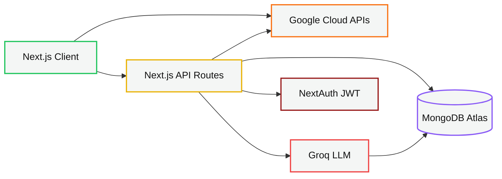

<div align="center">

# BreatheSafe

**Because the air we breathe should be something we can see, understand, and act on.**

An Environmental Risk & Air Quality Monitoring Platform that turns raw pollutant
telemetry into a decision a person can make in five seconds.

[Architecture](docs/architecture.md) · [Diagram](architecture-diagram.png) · [API reference](api-documentation.md) · [Deployment](#deployment)

</div>

---

## Team

|                       |                                                                                                         |
| --------------------- | ------------------------------------------------------------------------------------------------------- |
| **Team**              | RICR-HIM-1243                                                                                           |
| **Members**           | Anirudh Sahu (solo)                                                                                     |
| **Live demo**         | [hack-in-motion-ricr-him-1243-three.vercel.app](https://hack-in-motion-ricr-him-1243-three.vercel.app/) |
| **Theme**             | Environment & CleanTech                                                                                 |
| **Problem statement** | Environmental Risk & Air Quality Monitoring Platform                                                    |

---

## Why this exists

Air quality data is public, but it isn't _usable_. It arrives as µg/m³ of PM2.5 across
a dozen incompatible national scales, averaged over an entire city, on a dashboard that
assumes you already know what "154 AQI, dominant pollutant PM10" means for a
seven-year-old with asthma.

BreatheSafe closes that last mile. It answers four questions the raw data does not:

| Question                           | How BreatheSafe answers it                                                                             |
| ---------------------------------- | ------------------------------------------------------------------------------------------------------ |
| _How bad is it, really?_           | A single colour-coded risk band, plus a **cigarette-equivalent** translation of the fine-particle load |
| _How bad is it **for me**?_        | Health-profile-aware guidance and an **inhaled-dose** estimate scaled to your breathing rate           |
| _What do I do about it?_           | **Clean-air windows** the specific hours in the next 48 when it's safe for _you_ to go outside         |
| _Is this getting better or worse?_ | 30-day trend charts backfilled from real history, plus a short-term hourly trend call                  |

---

## Screenshots


## Feature tour

### Core platform

| Feature                                                                                                                                      | Where                                   |
| -------------------------------------------------------------------------------------------------------------------------------------------- | --------------------------------------- |
| **Secure accounts** bcrypt-hashed credentials, JWT sessions, every query scoped to `userId`                                                  | `/login`, `/signup`                     |
| **Rate-limited public routes** the demo search and map tiles stay public by design, so they're capped per-IP instead of auth-gated           | `src/lib/rate-limit.ts`                 |
| **Search anywhere** by city name (Geocoding API), by map click, or by device geolocation with reverse-geocoded display names                 | `/dashboard`                            |
| **Risk classification engine** a documented six-band model over the US EPA 0–500 scale                                                       | `src/lib/risk-engine.ts`                |
| **Personalised guidance** advice branches on conditions (asthma, COPD, heart disease, allergies, pregnancy), age group, and activity level   | `src/components/aqi/HealthGuidance.tsx` |
| **Saved locations** home, work, a child's school; each with its own alert threshold, all at a glance                                         | `/dashboard`                            |
| **Historical trends** 7/30-day charts, backfilled from Google's history API on first load, then kept fresh by opportunistic hourly snapshots | `/dashboard`                            |
| **Alerts** threshold crossings _and_ rapid-change detection, with a 3-hour per-type cooldown so the feed stays trustworthy                   | `/dashboard/alerts`                     |
| **Persistence** MongoDB via Mongoose: users, locations, snapshots, alerts, community reports                                                 | `src/models/`                           |
| **Responsive, calm UI** Tailwind + shadcn/Base UI, dark mode, GSAP reveals, skeleton loaders, colour-coded everywhere                        | throughout                              |
| **Graceful degradation** typed error classes, retry affordances on every fetch, an offline banner, and a root error boundary                 | `src/app/error.tsx`                     |

### Challenge features all six, implemented

| Feature                            | Detail                                                                                                                                    |
| ---------------------------------- | ----------------------------------------------------------------------------------------------------------------------------------------- |
| **Route risk planner**             | Real road geometry from the Directions API, decoded polyline sampled at intervals, each sample scored "is this jog safe _right now_"      |
| **Community reporting**            | Geo-indexed (`2dsphere`) reports of smoke, waste burning, industrial emissions; `$nearSphere` radius queries, upvotes, 24-hour TTL expiry |
| **48-hour forecast**               | Hourly predictions from the Air Quality API, grouped into days _and_ preserved hourly for window-finding                                  |
| **Multi-language + voice**         | English/Hindi UI, and Web Speech API narration of alerts and conditions in the user's locale                                              |
| **Comparison mode**                | Side-by-side multi-city comparison on a shared axis                                                                                       |
| **Simulated wearable integration** | Activity level and age group drive a physiological breathing-rate model that personalises inhaled dose (below)                            |

### Beyond the brief

The parts we're proudest of none of these are in the problem statement.

- **Cigarette equivalence.** Berkeley Earth's rule of thumb (22 µg/m³ of PM2.5 for 24 h ≈
  one cigarette), rendered as an actual row of cigarette icons. It converts an abstract
  index into the most viscerally understood health unit there is. When Google reports an
  index without a PM2.5 concentration, we back one out of the AQI using the EPA's
  piecewise-linear breakpoints and label the result as estimated.
  See `src/lib/exposure.ts`.

- **Personal inhaled dose.** The AQI is identical for everyone on the same street; the
  _dose_ is not. A runner moves ~2.6 m³ of air per hour, someone at a desk ~0.42 m³. We
  multiply concentration by activity-specific minute ventilation and weight the result by
  age susceptibility (children 1.6×, seniors 1.3×) to produce an effective dose per hour.
  This is the "simulated wearable/health data" challenge, built on a real physiological
  model rather than a fake step counter.
  See `src/lib/exposure.ts`.

- **Clean-air windows.** Every other product collapses the hourly forecast into a daily
  average and says "avoid outdoor activity today." But AQI swings two or three risk bands
  within a single day, so that advice is usually wrong. We scan the 48 hourly points for
  contiguous runs below a **personal** ceiling (100 for vulnerable users and athletes, 150
  otherwise) and surface the best three as _"Tomorrow, 6 AM – 9 AM · 3h clear · peaks at
  AQI 88."_ Actionable instead of prohibitive.
  See `src/lib/clean-air-windows.ts`.

- **A grounded AI assistant, everywhere in the app.** A floating bot-icon widget mounted
  in the dashboard layout, not one page — Groq (`llama-3.3-70b-versatile`) with every
  request enriched by the user's name, health profile, saved locations, browser
  geolocation, and live AQI. If the user names a city mid-conversation, the server
  resolves it against saved locations or geocodes it and fetches real conditions
  _before_ calling the model — the system prompt explicitly forbids simulating data.
  See `src/app/api/ai/chat/route.ts`.

- **Official Google AQI heatmap tiles**, proxied server-side so the API key never reaches
  the browser, overlaid on theme-aware vector maps.
  See `src/app/api/aqi/heatmap-tile/[mapType]/[z]/[x]/[y]/route.ts`.

- **Pollen forecasts** (tree/grass/weed) alongside AQI, with genuine coverage gaps handled
  as an expected empty state rather than an error.

- **WHO-guideline framing.** Every reading is also expressed as a multiple of the WHO
  24-hour PM2.5 guideline (15 µg/m³) the number that actually defines "safe."

---

## The data source, and why

**Google Maps Platform Air Quality API** is the primary source, alongside the Pollen,
Geocoding, and Directions APIs from the same platform.

### How we chose

| Candidate                  | Verdict                                                                                                                                                                          |
| -------------------------- | -------------------------------------------------------------------------------------------------------------------------------------------------------------------------------- |
| **OpenAQ**                 | Excellent open raw sensor data, but station-level only: large coverage holes between monitors, no forecast, no health guidance. We'd have had to build interpolation ourselves.  |
| **WAQI / AQICN**           | What we originally built on. Good station coverage and free, but the token model is per-station, historical data is thin, and forecast payloads are inconsistent across regions. |
| **IQAir**                  | High quality with good forecasts, but historical endpoints sit behind a commercial enterprise tier.                                                                              |
| **Google Air Quality API** | **Chosen.**                                                                                                                                                                      |

### Why Google won

1. **Global ~500 m resolution, not station points.** Google fuses government monitors,
   satellite data, traffic, and dispersion models into a continuous grid. A city-wide
   average doesn't tell you about your neighbourhood this does, and it doesn't return
   "no data" just because the nearest monitor is 30 km away.
2. **Local AQI scales, correctly.** It returns both the Universal AQI and the
   _country-specific_ index (`usa_epa`, `ind_cpcb`, …), so users see the scale their own
   government and news outlets use.
3. **Health recommendations built in.** Per-population guidance (elderly, lung disease,
   heart disease, athletes, pregnant women, children) that we blend with our own engine.
4. **History and forecast from one vendor.** 720 hours back, 96 hours forward, same auth,
   same scale which is exactly what makes the trend chart and clean-air windows possible.
5. **Heatmap tiles.** Pre-rendered raster AQI tiles that drop straight onto a map.
6. **One platform, one bill.** Air Quality, Pollen, Geocoding, and Directions share
   credentials and quota.

### The scale trap that would have shipped a dangerous bug

Google returns **two indices** for most locations, and they run in **opposite directions**:

| Index                               | Range | Direction               |
| ----------------------------------- | ----- | ----------------------- |
| `uaqi` (Universal AQI)              | 0–100 | **higher = better air** |
| `usa_epa`, `ind_cpcb`, … (regional) | 0–500 | higher = worse air      |

Reading the wrong one silently reports hazardous air as "Good." We hit this in
development: Delhi displayed **AQI 35 Good** while PM10 sat at 148 µg/m³. The fix is
`pickIndex()` in `src/lib/google-aqi.ts`, which selects any index whose code is _not_
`uaqi`, falls back to `uaqi` only where no regional index exists, and flags that case via
`scale: "universal"` so callers never run it through the EPA bands. We standardised the
app on the US EPA 0–500 scale because it matches our risk-engine thresholds exactly.

### Integration points

| API                                    | Used for                                                     | Module                           |
| -------------------------------------- | ------------------------------------------------------------ | -------------------------------- |
| Air Quality `currentConditions:lookup` | Live AQI, pollutants, health recommendations                 | `src/lib/google-aqi.ts`          |
| Air Quality `forecast:lookup`          | 48-hour hourly forecast → daily cards + clean-air windows    | `src/lib/google-aqi.ts`          |
| Air Quality `history:lookup`           | 30-day trend backfill (`hours` param, max 720)               | `src/lib/google-aqi.ts`          |
| Air Quality `heatmapTiles`             | Map overlay, proxied to hide the key                         | `src/app/api/aqi/heatmap-tile/…` |
| Geocoding                              | City → coordinates, and reverse for map clicks / geolocation | `src/lib/google-aqi.ts`          |
| Directions                             | Real road polylines for route risk scoring                   | `src/lib/google-directions.ts`   |
| Pollen `forecast:lookup`               | Tree / grass / weed indices                                  | `src/lib/google-pollen.ts`       |
| Maps JavaScript SDK                    | Interactive maps via `@vis.gl/react-google-maps`             | `src/components/map/`            |
| Groq `chat/completions`                | Grounded AI assistant                                        | `src/lib/groq.ts`                |

---

## The risk classification engine

The technical core. Two stages: **classify**, then **personalise**.

### Stage 1 Classification

A pure function over the US EPA 0–500 scale (`src/lib/risk-engine.ts`) returning a band
with a label, colour, icon, and description. The same table drives badges, gauges, chart
reference bands, and the map legend, so a colour always means exactly one thing.

| AQI     | Level                          | Colour    |
| ------- | ------------------------------ | --------- |
| 0–50    | Good                           | `#22c55e` |
| 51–100  | Moderate                       | `#eab308` |
| 101–150 | Unhealthy for Sensitive Groups | `#f97316` |
| 151–200 | Unhealthy                      | `#ef4444` |
| 201–300 | Very Unhealthy                 | `#8b5cf6` |
| 301+    | Hazardous                      | `#991b1b` |

### Stage 2 Personalisation

The same AQI produces materially different output per user:

- **Vulnerability** any declared condition, or a `child`/`senior` age group, lowers
  every threshold by one band.
- **Exertion** thresholds tighten again for `active`/`athlete` users, because dose
  scales with minute ventilation, not with the index.
- **Condition-specific precautions** asthma → keep a rescue inhaler accessible; heart
  disease → avoid strenuous activity; pregnancy → limit outdoor exposure; and so on.
- **Concrete actions** mask class (none → N95 → N99/P100), window advice, exercise
  advice, purifier recommendations.
- **Google's own recommendations** for the matching population, shown alongside and
  clearly attributed.

At AQI 120, a sedentary healthy adult sees _"reduce prolonged outdoor exertion."_ An
asthmatic parent sees _"stay indoors, keep windows closed, keep your rescue inhaler
accessible, keep children indoors"_ plus an inhaled-dose figure and the next window
when it's genuinely safe to step outside.

---

## Architecture



| Layer              | Role                                                                                                                   |
| ------------------ | ---------------------------------------------------------------------------------------------------------------------- |
| Next.js Client     | React UI dashboard, maps, charts                                                                                       |
| Next.js API Routes | ~20 auth-scoped endpoints: `aqi`, `locations`, `alerts`, `community`, `ai/chat`                                        |
| Google Cloud APIs  | Air Quality, Geocoding, Pollen, Directions                                                                             |
| Groq LLM           | Llama 3.3 70B grounded chat assistant                                                                                  |
| NextAuth (JWT)     | bcrypt credentials, server-side session on every route                                                                 |
| MongoDB Atlas      | `User`, `Location`, `AQISnapshot`, `Alert`, `CommunityReport` (2dsphere geo-index, TTL expiry, compound history index) |

Full write-up, request lifecycles, and data flow: **[docs/architecture.md](docs/architecture.md)**.

### Project layout

```
src/
  app/
    (auth)/            login, signup
    (dashboard)/       dashboard, alerts, community, compare, forecast, profile, route-planner
    api/               route handlers  see api-documentation.md
    error.tsx          root error boundary
  components/
    aqi/               gauge, risk badge, guidance, pollutants, pollen, exposure insights
    charts/            trend + comparison (Recharts)
    dashboard/         search, saved locations, alerts feed, AI assistant
    map/               Google Maps, heatmap overlay, route planner
    motion/            GSAP reveal + magnetic primitives
    ui/                shadcn / Base UI primitives
  lib/                 domain logic + API clients
  models/              Mongoose schemas
  types/               shared domain types
```

### Data model

| Collection         | Key fields                                                                                                | Indexes                        |
| ------------------ | --------------------------------------------------------------------------------------------------------- | ------------------------------ |
| `users`            | `email` (unique), `password` (bcrypt), `healthProfile{conditions[], ageGroup, activityLevel}`, `language` | unique on `email`              |
| `locations`        | `userId`, `name`, `city`, `lat`, `lng`, `alertThreshold` (default 100), `isActive`                        | `userId`                       |
| `aqisnapshots`     | `locationId`, `timestamp`, `aqi`, `dominantPollutant`, `pollutants{}`, `source`                           | `(locationId, timestamp ↓)`    |
| `alerts`           | `userId`, `locationId`, `type`, `severity`, `title`, `message`, `aqiValue`, `read`                        | `(userId, read, createdAt ↓)`  |
| `communityreports` | `userId`, GeoJSON `location`, `type`, `severity`, `upvotes[]`, `expiresAt`                                | `2dsphere`, TTL on `expiresAt` |

---

## Error handling

Never a blank screen. Every failure mode has a designed state:

| Failure                         | Behaviour                                                                                      |
| ------------------------------- | ---------------------------------------------------------------------------------------------- |
| Invalid / unknown city          | Inline message with a **Retry** action on the search form                                      |
| No monitoring coverage          | Typed `GoogleAqiError("No air quality station near this location")` → friendly copy, not a 500 |
| Forecast unavailable            | Current conditions still return; forecast degrades to an empty array and the UI says so        |
| Pollen not covered (e.g. India) | Treated as an expected empty state, not an error no scary banner                               |
| Groq / AI unavailable           | Reported inside the chat bubble; the rest of the dashboard is unaffected                       |
| Network offline                 | Persistent `OfflineBanner`                                                                     |
| Missing PM2.5 concentration     | Dose derived from AQI via EPA breakpoints and clearly labelled _estimated_                     |
| Unhandled render error          | Root `error.tsx` boundary with a reset button                                                  |
| Unauthenticated API access      | `401` before any DB work; every query scoped to the session `userId`                           |

---

## Getting started

### Prerequisites

- Node.js 18.17+
- A MongoDB database (Atlas free tier is fine)
- A Google Cloud project with billing enabled
- A [Groq API key](https://console.groq.com/keys) (free tier)

### 1. Enable the Google APIs

In [Google Cloud Console](https://console.cloud.google.com/apis/library), enable:

- Air Quality API
- Pollen API
- Geocoding API
- Directions API
- Maps JavaScript API

Then create **two** keys under _APIs & Services → Credentials_:

| Key         | Restriction                                                                                                                 | Env var                           |
| ----------- | --------------------------------------------------------------------------------------------------------------------------- | --------------------------------- |
| Server key  | _API restrictions_: Air Quality, Pollen, Geocoding, Directions. No referrer restriction (server-to-server).                 | `GOOGLE_API_KEY`                  |
| Browser key | _Application restrictions_: HTTP referrers (`localhost:3000/*`, your domain). _API restrictions_: Maps JavaScript API only. | `NEXT_PUBLIC_GOOGLE_MAPS_API_KEY` |

Two keys, not one the browser key ships to every visitor by design, so it must not be
able to spend your Air Quality quota. Also create a **vector Map ID** in
[Maps Studio](https://console.cloud.google.com/google/maps-apis/studio/maps) for advanced
markers and theme-aware maps.

### 2. Install and configure

```bash
git clone https://github.com/anirudh12032008/breathesafe.git
```

```bash
npm install && cp .env.example .env.local
```

Fill in `.env.local`:

```env
MONGODB_URI=mongodb+srv://<user>:<password>@<cluster>.mongodb.net/breathsafe
NEXTAUTH_SECRET=<openssl rand -base64 32>
NEXTAUTH_URL=http://localhost:3000
GOOGLE_CLIENT_ID=<google oauth client id>
GOOGLE_CLIENT_SECRET=<google oauth client secret>
GOOGLE_API_KEY=<server key>
GROQ_API_KEY=<groq key>
NEXT_PUBLIC_GOOGLE_MAPS_API_KEY=<browser key>
NEXT_PUBLIC_GOOGLE_MAPS_MAP_ID=<vector map id>
NEXT_PUBLIC_VAPID_PUBLIC_KEY=<vapid public key>
VAPID_PRIVATE_KEY=<vapid private key>
VAPID_SUBJECT=mailto:you@example.com
```

| Variable                                                               | Purpose                                                                                                    |
| ---------------------------------------------------------------------- | ---------------------------------------------------------------------------------------------------------- |
| `MONGODB_URI`                                                          | MongoDB Atlas (or local) connection string                                                                 |
| `NEXTAUTH_SECRET` / `NEXTAUTH_URL`                                     | Session signing + callback base URL                                                                        |
| `GOOGLE_CLIENT_ID` / `GOOGLE_CLIENT_SECRET`                            | Google OAuth app, for "Continue with Google" sign-in                                                       |
| `GOOGLE_API_KEY`                                                       | Server-only key for Air Quality, Pollen, Geocoding, Directions                                             |
| `GROQ_API_KEY`                                                         | AI chat assistant (Llama 3.3 70B via Groq)                                                                 |
| `NEXT_PUBLIC_GOOGLE_MAPS_API_KEY`                                      | Browser-facing Maps JavaScript SDK key                                                                     |
| `NEXT_PUBLIC_GOOGLE_MAPS_MAP_ID`                                       | Vector Map ID for theme-aware, advanced-marker maps                                                        |
| `NEXT_PUBLIC_VAPID_PUBLIC_KEY` / `VAPID_PRIVATE_KEY` / `VAPID_SUBJECT` | Web Push keypair for lock-screen alert notifications generate once with `npx web-push generate-vapid-keys` |

### 3. Run

```bash
npm run dev
```

Open <http://localhost:3000>, sign up, set a health profile at `/dashboard/profile`
(this is what unlocks personalised guidance, dose, and clean-air windows), then search a
city.

### Scripts

| Command            | Purpose                    |
| ------------------ | -------------------------- |
| `npm run dev`      | Dev server                 |
| `npm run build`    | Production build           |
| `npm start`        | Serve the production build |
| `npm run lint`     | ESLint                     |
| `npx tsc --noEmit` | Typecheck                  |

---

## Deployment

**Live:** [hack-in-motion-ricr-him-1243-three.vercel.app](https://hack-in-motion-ricr-him-1243-three.vercel.app/)

Deployed on Vercel. To deploy your own:

1. Push to GitHub and import the repo at [vercel.com/new](https://vercel.com/new).
2. Add all twelve environment variables to the Vercel project, setting `NEXTAUTH_URL` to
   your production URL.
3. Add your Vercel domain to the browser key's HTTP-referrer allowlist.
4. Allow Vercel's egress in MongoDB Atlas → _Network Access_ (`0.0.0.0/0` for a demo; a
   private endpoint for anything real).

Snapshots are written opportunistically whenever a saved location is fetched, so trend
history builds without a cron job. `/api/alerts/check` can additionally be hit by a
Vercel Cron entry for background alerting.

---

## Tech stack

| Layer     | Choice                             | Why                                                                            |
| --------- | ---------------------------------- | ------------------------------------------------------------------------------ |
| Framework | Next.js 14 (App Router)            | Route handlers keep API keys server-side; RSC keeps the client bundle small    |
| Language  | TypeScript (strict)                | Domain types shared across client, server, and models                          |
| Database  | MongoDB + Mongoose                 | Geospatial (`2dsphere`) and TTL indexes come free; flexible snapshot documents |
| Auth      | NextAuth (credentials + JWT)       | Health profile and locale ride in the token, so no DB hit per render           |
| Styling   | Tailwind CSS v4 + shadcn / Base UI | Accessible primitives, one token set, first-class dark mode                    |
| Charts    | Recharts                           | Composable, responsive, works with our AQI reference bands                     |
| Maps      | `@vis.gl/react-google-maps`        | Official React bindings, advanced markers, theme-aware vector maps             |
| Motion    | GSAP                               | Reveal / stagger without layout thrash                                         |
| AI        | Groq (`llama-3.3-70b-versatile`)   | Fast, free tier, OpenAI-compatible                                             |

---

## Future scope

- **Scheduled ingestion pipeline** replace the opportunistic snapshot pattern (a
  snapshot is only written when a saved location happens to be viewed) with a proper
  cron/queue worker, so trend charts fill in on a schedule instead of depending on
  traffic.
- **Broader wearable signals** Web Bluetooth also exposes standard GATT services for
  SpO2 and skin temperature on many devices, which would sharpen the exposure model
  further for respiratory-condition users specifically.
- **School & office fleet accounts** one health-profile-aware dashboard covering many
  saved locations at once, so an institution can watch every classroom or building
  instead of one parent watching one child.
- **Real road-following route sampling everywhere** the route planner already decodes
  the Directions API polyline and samples along it; extending that same real-geometry
  sampling to the comparison and forecast views is a natural next step.
- **CDN/edge caching** for the heatmap tile proxy and current-conditions responses, to
  cut latency and external API spend at higher traffic.

---

## Documentation

- **[api-documentation.md](api-documentation.md)** every endpoint, with
  request/response shapes and status codes
- **[docs/architecture.md](docs/architecture.md)** system design, request lifecycles,
  and the architecture diagram source
- **`.env.example`** annotated environment reference

---

## License

Built for HackInMotion. Air quality data © Google. Cigarette-equivalence model after
Berkeley Earth. AQI bands after the US EPA.
