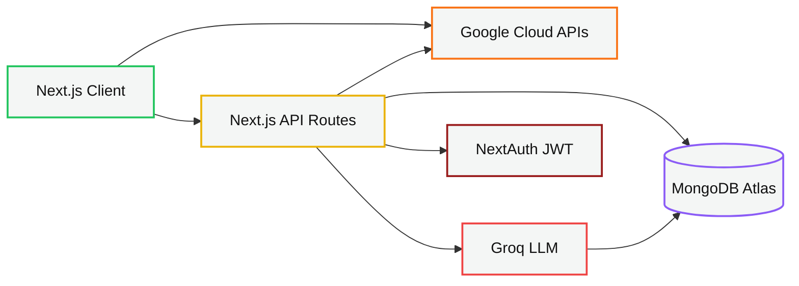
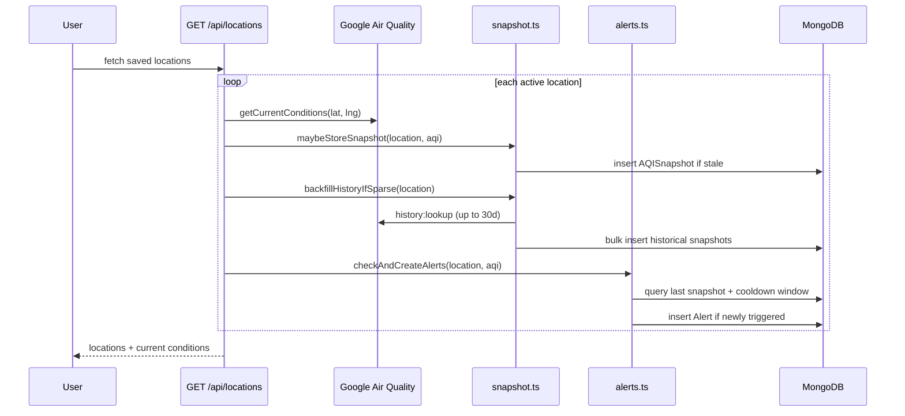
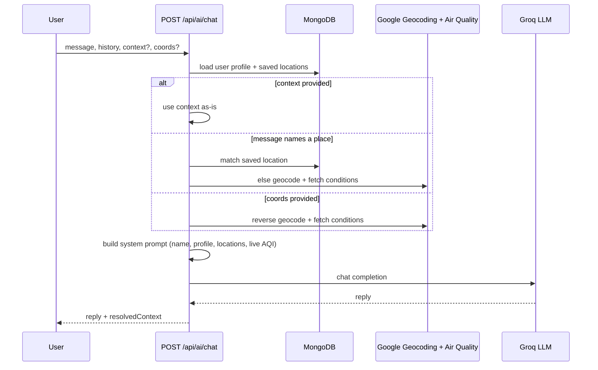

# Architecture

## System overview



| Node | Contents |
| --- | --- |
| Next.js Client | Dashboard, map, trends, alerts, compare, route planner, community — plus Web Speech voice alerts |
| Next.js API Routes | `aqi/*`, `locations`, `alerts`, `community`, `ai/chat`, `route/directions`, and the heatmap-tile key proxy |
| Google Cloud APIs | Air Quality, Geocoding, Pollen, Directions, Maps JavaScript |
| Groq LLM | Llama 3.3 70B, grounded with live AQI before every call |
| NextAuth (JWT) | bcrypt credentials, session on every protected route |
| MongoDB Atlas | Users, locations, AQI snapshots, alerts, community reports |

Domain logic (`risk-engine`, `exposure`, `clean-air-windows`, `route-risk`, `alerts`,
`snapshot`) sits inside the API layer as pure functions with no framework or database
imports — see "Why domain logic is separated" below.

## Request lifecycles

### Search → risk → guidance

1. Client calls `GET /api/aqi/current?city=<name>`.
2. Handler geocodes the name (Google Geocoding), then fetches current conditions and the
48-hour forecast **in parallel** (`Promise.all`).
3. `getCurrentConditions()` reads `data.indexes[]` and runs `pickIndex()` — the fix for the
inverted-scale bug described in the README — to select the regional index (e.g.
`usa_epa`) over Google's Universal AQI whenever one exists.
4. `classifyRisk(aqi)` maps the number to a six-band classification shared by every visual
in the app (`src/lib/risk-engine.ts`).
5. Response returns to the client, which renders `AQICard`. That component reads the
session's `healthProfile` and calls `getHealthGuidance()` and `estimateExposure()`
client-side — no extra round trip, because the profile already lives in the JWT.

### Saved locations → snapshots → alerts (the loop that builds history)



This is why the trend chart has real data from the first session: backfill runs
opportunistically the first time a location is fetched, not on a schedule. Alerts are
evaluated in the same pass so a threshold crossing is visible on the very next page load.

### Route risk planning

`POST /api/route/directions` calls Google Directions, decodes the returned polyline with a
hand-written implementation of Google's polyline algorithm (`src/lib/google-directions.ts`),
then `sampleAlongPath()` (`src/lib/route-risk.ts`) walks the real road geometry at even
intervals and fetches AQI for each sample point. If Directions fails, the planner falls
back to straight-line sampling between the two endpoints and the map draws the fallback
route as a dashed line so the degraded state is visible, not silent.

### Grounded AI chat



Grounding happens *before* the model is called, not after — the model never receives a
prompt without either real data or an explicit instruction to ask for a location, which is
what eliminates the "let me simulate the data" failure mode.

## Data flow: from Google's payload to a UI colour

```
Google currentConditions:lookup
→ indexes[] (uaqi + regional)
→ pickIndex() selects regional, flags scale
→ { aqi, pollutants, dominantPollutant }
├─→ classifyRisk(aqi) → { level, label, color, emoji } (risk-engine.ts)
├─→ estimateExposure(aqi, pm25, profile) → cigarettes, dose (exposure.ts)
└─→ getHealthGuidance(aqi, profile) → precautions, mask (risk-engine.ts)

Google forecast:lookup
→ hourlyForecasts[] (48 points)
├─→ groupForecastByDay() → daily min/avg/max for cards+chart (forecast.ts)
└─→ findCleanAirWindows(hourly, ceiling) → best hours to go (clean-air-windows.ts)
```

## Why domain logic is separated from route handlers

Every risk, exposure, and windowing calculation lives in `src/lib/*.ts` as a pure function
with no `axios`, no `mongoose`, and no `NextResponse` import. Route handlers are thin: fetch,
call the pure function, return JSON. This is what let the inverted-AQI-scale bug, the
forecast `period` bug, and the history `hours` bug all get fixed and verified by reading
one file each, without touching a single UI component.

## Security notes

- `GOOGLE_API_KEY` (server) never reaches the client; the browser only ever sees
`NEXT_PUBLIC_GOOGLE_MAPS_API_KEY`, a separate, referrer-restricted key with Maps
JavaScript API as its only allowed API.
- Heatmap tiles are proxied through `/api/aqi/heatmap-tile` specifically so the server key
is never embedded in a tile URL the browser requests directly.
- Every location/alert/profile query filters on the session `userId` at the database layer,
not just at the route-handler auth check — there is no endpoint that returns another
user's data by supplying a different ID.
- Passwords are bcrypt-hashed; the hash is excluded from every `select()` outside the
NextAuth `authorize()` callback.
